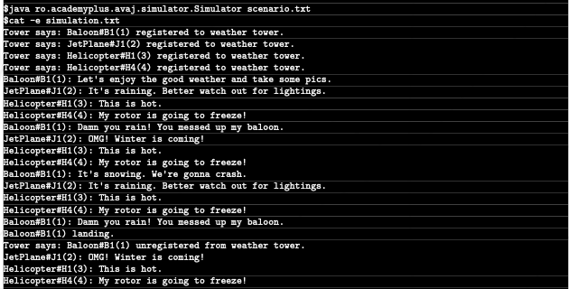

# 42AvajLauncher:
## Subject:
### General instructions:
You need to implement an aircraft simulation program based on the class diagram pro-
vided to you. All classes are required to be implemented respecting every detail provided
in the diagram. Feel free to add more classes or include additional attributes if you think
it is necessary, but do not change access modifiers or the class hierarchy for the classes
provided in the diagram.

### Program behaviour:
Your program will take one and only one argument from the command line. This argu-
ment represents the name of a text file that will contain the scenario that needs to be
simulated. You can find an example file provided with the subject.
Executing the program will generate a file simulation.txt that describes the outcome
of the simulation.

### Given UML Diagram:

### Expected output:

## How to understand UML Diagram ?
### Access modifiers symbols meanings :

- + Public
> This class member can be accessed from anywhere.
- - Private
> This class member can only be accessed within the same class.
- \# Protected
> This class member can be accessed within the same class and outside only in a child class.

### Class relations lines meanings :
- → Inheritance
> A relationship in which a class extends another class.
- ⇢ Dependancies
> A relationship in which one element benefits from or depends on another element.
- ◇ Aggregation
> A Relationship in which an element uses another element.
- ◆ Composition
> A Relationship in which the life cycles of the elements and the aggregate are linked: if the aggregate is destroyed, so are its components.
